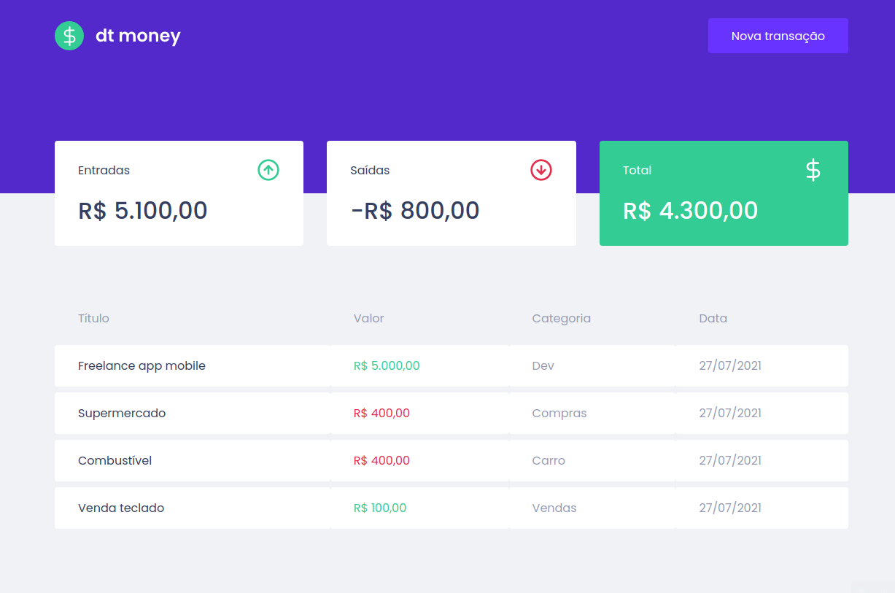
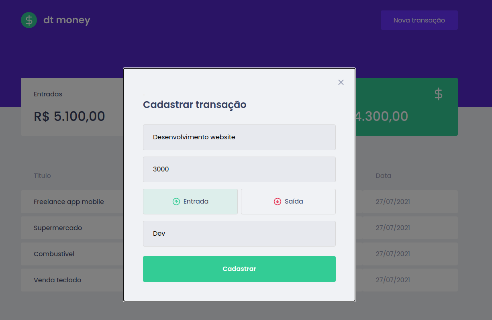

<h1 align="center">
  
</h1>

<p align="center">
  <a href="#-projeto">Projeto</a>&nbsp;&nbsp;&nbsp;|&nbsp;&nbsp;&nbsp;
  <a href="#-tecnologias-utilizadas">Tecnologias Utilizadas</a>&nbsp;&nbsp;&nbsp;|&nbsp;&nbsp;&nbsp;
  <a href="#-como-executar">Como executar</a>&nbsp;&nbsp;&nbsp;|&nbsp;&nbsp;&nbsp;
  <a href="#-licença">Licença</a>
</p>

<p align="center">
  
</p>

<p align="center">
  
  
</p>

## 💻 Projeto

O DtMoney é um aplicativo para realizar controle financeiro pessoal, permitindo que o usuário cadastre transações de entradas e saídas.

## ✨ Tecnologias Utilizadas

Esse projeto foi desenvolvido com as seguintes tecnologias:

- [React](https://reactjs.org)
- [Create React App](https://create-react-app.dev/)
- [TypeScript](https://www.typescriptlang.org/)

## 🚀 Como Utilizar

- Necessário ter instalado o [Node.js](https://nodejs.org/en/) e [Yarn](https://yarnpkg.com/) para executar o projeto.

**Clone o projeto**

```bash
git clone https://github.com/FlavioSant/dt-money.git
```

**Siga os passos abaixo:**

```bash
# Instale as dependências
yarn

# Execute o projeto
yarn start
```

O aplicativo estará rodando em seu navegador em: `http://localhost:3000`

## 📄 Licença

Esse projeto está sob a licença MIT. veja o arquivo [LICENSE](LICENSE) para mais detalhes.

---

By Flávio Santos.

[](https://www.linkedin.com/in/flavio-santos-75487a164/) [](https://www.instagram.com/flavio_santos_/) [](https://www.facebook.com/flavio.santos.9887)
